# OpenReadout

> **OpenReadout is an open-source reader for lab-instrument files, designed for AI agents.**

**Give AI agents full access to raw data from microscopes, mass spectrometers, cytometers, electrophysiology rigs, and 90+ other instrument file formats — in one command.**

Open-source. Single binary. No vendor software. No dependencies. No network access. Works everywhere.

**OpenReadout makes data stored in proprietary instrument file formats readable: it pulls out the metadata, images, traces, spectra, and tables as structured JSON and renders previews so your agent can see and understand the data.** Every format is validated against real data and independent libraries.

[](https://github.com/openreadout/openreadout/actions/workflows/ci.yml)
[](https://openreadout.github.io/openreadout/)
[](#license)

<p align="center">
  <strong>📖 Docs:</strong> <a href="https://openreadout.github.io/openreadout/">openreadout.github.io/openreadout</a> &nbsp;|&nbsp; <strong>🧪 Try it:</strong> <a href="https://openreadout.github.io/openreadout/demo/index.html">browser demo</a>
</p>

<p align="center">
  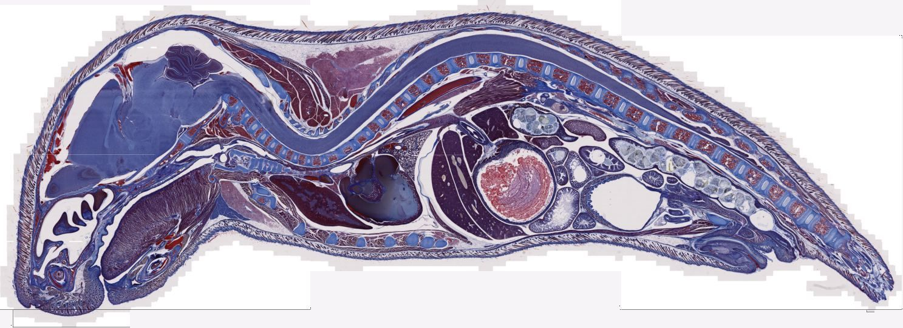
</p>

<p align="center"><em>A whole-mouse section from a 3.7 GB Zeiss slide scan: 190,309 × 69,378 pixels at 0.22 µm.</em></p>

<table>
<tr>
<td width="33%">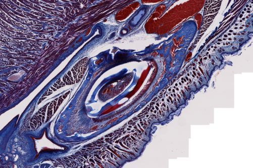</td>
<td width="33%">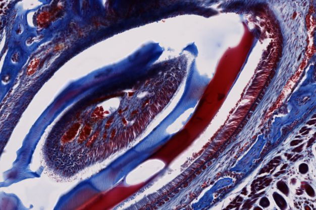</td>
<td width="33%">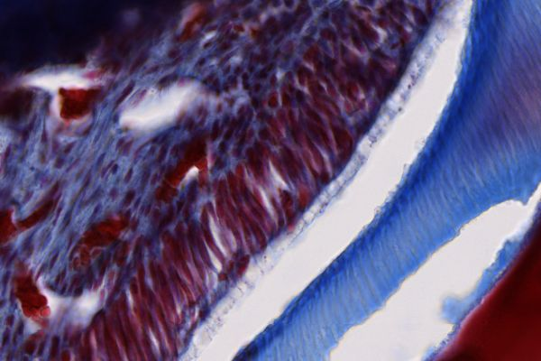</td>
</tr>
</table>

<p align="center">—</p>
<p align="center"><strong>Microscopy</strong></p>

<table>
<tr>
<td width="33%">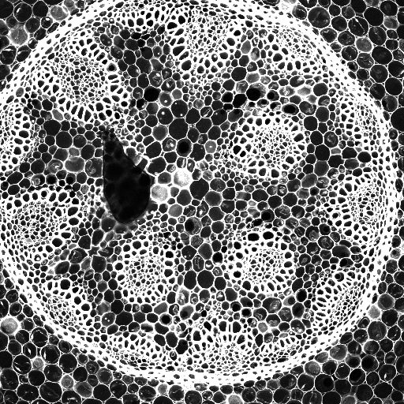</td>
<td width="33%">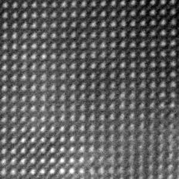</td>
<td width="33%">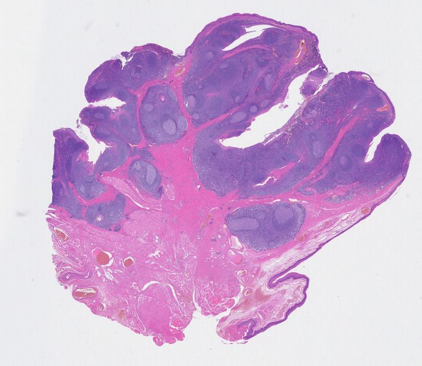</td>
</tr>
<tr>
<td align="center"><sub>Leica LIF · confocal lambda scan</sub></td>
<td align="center"><sub>Gatan DM3 · atomic-resolution STEM</sub></td>
<td align="center"><sub>PerkinElmer QPTIFF · H&amp;E whole slide</sub></td>
</tr>
</table>

<p align="center">—</p>
<p align="center"><strong>Spectra, Traces, and Curves</strong></p>

<table>
<tr>
<td width="33%">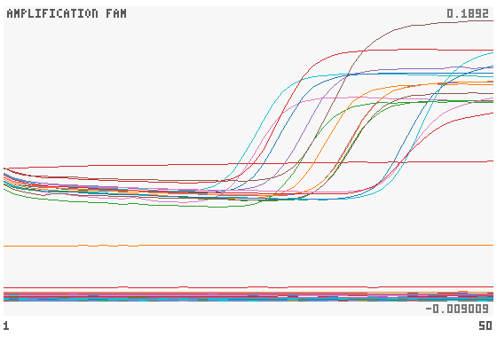</td>
<td width="33%">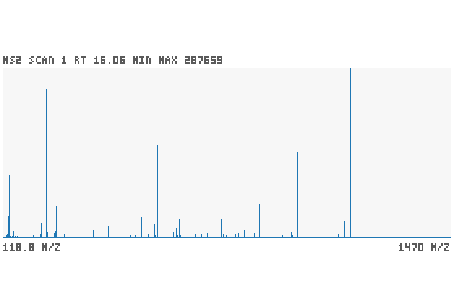</td>
<td width="33%">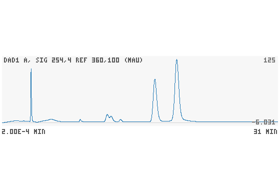</td>
</tr>
<tr>
<td align="center"><sub>Roche LightCycler · qPCR amplification</sub></td>
<td align="center"><sub>Thermo Orbitrap RAW · MS2 spectrum</sub></td>
<td align="center"><sub>Agilent HPLC · DAD chromatogram</sub></td>
</tr>
<tr>
<td width="33%">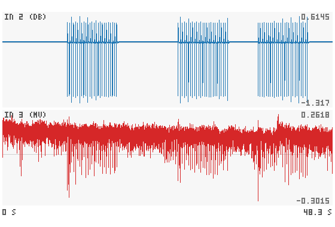</td>
<td width="33%">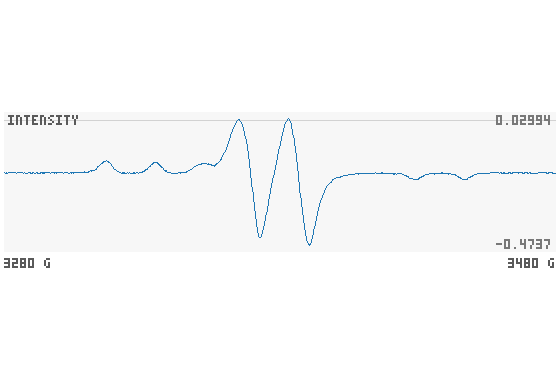</td>
<td width="33%">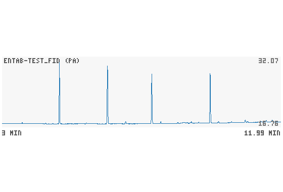</td>
</tr>
<tr>
<td align="center"><sub>Axon ABF · patch clamp</sub></td>
<td align="center"><sub>Bruker ELEXSYS · EPR spectrum</sub></td>
<td align="center"><sub>Agilent ChemStation · GC-FID</sub></td>
</tr>
</table>

<p align="center"><em>Everything above was decoded by OpenReadout from raw files — no vendor software, no conversion.</em></p>

## For AI Agents — Get Started in One Line

Paste this into your AI agent's chat — it will read the skill file and install everything:

```
curl -fsSL https://raw.githubusercontent.com/openreadout/openreadout/main/skills/openreadout/SKILL.md
```

That's it. The skill file tells the agent how to install the binary and how to use every command.

## For Humans

**Option A — Browser:** Open the [browser demo](https://openreadout.github.io/openreadout/demo/index.html) and drop a file on it. It runs OpenReadout compiled to WebAssembly inside the page; nothing is uploaded.

**Option B — CLI:** Install the binary (see [Installation](#installation)), then connect it to your agent:

```bash
openreadout self skill --install all      # skill for Claude Code, Codex, Cursor, Copilot, Gemini CLI
openreadout mcp --install claude-desktop  # MCP server for Claude Desktop (or cursor, codex, vscode, ...)
```

Your agent can now open, check, plot, and convert instrument files on your behalf.

## For Developers — See It Live in 30 Seconds

```bash
# 1. Install (macOS / Linux; other ways below)
curl -fsSL https://raw.githubusercontent.com/openreadout/openreadout/main/scripts/install.sh | sh

# 2. See what is in a file — reads headers only, fast on any size
openreadout info cells.lif

# 3. Look at it — writes cells.preview.png
openreadout preview cells.lif --composite

# 4. Convert it — read back and verified before it is saved
openreadout export cells.lif -o cells.ome.tiff
```

That's it. The same commands work on a CZI, an ND2, a Thermo RAW, an ABF, or any of the other formats.

<p align="center">
  
</p>

## Quick Start

```bash
# What is in the file?
openreadout info cells.lif
# → format: Leica LIF (lif) v2  size: 16.0 MiB  images: 1  planes: 2
# →   [0] PEI_laminin_35k  2048x2048 z=1 c=2 t=1  uint16  px=0.3250 µm
# →       objective: HC PL FLUOTAR L 20x/0.40 DRY

# Is it complete?
openreadout check partial-copy.lif
# → error  truncated       block chain runs past end of file
# → error  missing_planes  geometry needs 16777216 bytes but only 8969789 are stored

# Integrate the peaks of a chromatogram
openreadout analyze peaks gc-run.ch --min-height 1
# → 4 peaks, area in pA·min
# → 1   4.852 min  area 0.2779  25.08 %
# → ...

# Structured JSON for scripts and agents
openreadout info cells.lif --json
```

```json
{
  "ok": true,
  "schema_version": "2",
  "data": {
    "format": { "id": "lif", "name": "Leica LIF", "vendor": "Leica Microsystems" },
    "images": [
      {
        "size_x": 2048, "size_y": 2048, "size_c": 2,
        "pixel_type": "uint16",
        "physical_size": { "x": 0.325, "y": 0.325, "unit": "µm" }
      }
    ]
  }
}
```

## Why OpenReadout?

What used to take vendor software or a different library for every format:

```python
import czifile, nd2, liffile, pyabf, flowio
# ... a different API, metadata layout, and set of quirks for each one ...
```

Now takes one command, for all of them:

```bash
openreadout info any-file --json
```

**What OpenReadout can do:**

- **Inspect** images, channels, traces, spectra, tables, and metadata -- in plain text or structured JSON
- **Check** files for truncation, missing planes, and damaged structure -- exit code 4 when a file is corrupt
- **Export** to OME-TIFF, OME-Zarr, mzML, NWB, CSV, Parquet, Arrow, JCAMP-DX, Allotrope ASM, and RDML -- every export read back and verified
- **Preview** image planes, traces, spectra, and plate heat maps as PNG
- **Analyze** chromatographic peaks, plate assays (IC50, standard curves), qPCR (Cq, ΔΔCq), NMR peaks, patch-clamp features, spikes, and flow-cytometry gates -- with documented methods
- **Batch** over whole directories, index lab shares, and watch running acquisitions

| Area | Formats | Export to |
| --- | --- | --- |
| Light microscopy | Zeiss CZI, Nikon ND2, Leica LIF, Olympus OIR/VSI/OIB, Imaris, OME-TIFF and other TIFF variants, OME-Zarr, whole-slide images | OME-TIFF, OME-Zarr |
| High-content screening | Harmony (Opera Phenix, Operetta), ImageXpress, CellVoyager | OME-Zarr plate, OME-TIFF |
| Electron microscopy | MRC, Gatan DM3/DM4, FEI SER/EMI, Velox EMD | OME-TIFF, OME-Zarr |
| Mass spectrometry | Thermo RAW, Bruker timsTOF, Agilent MassHunter, Waters MassLynx, Sciex WIFF, mzML | mzML, Parquet, Arrow |
| Chromatography | Agilent ChemStation and OpenLab, Shimadzu, Chromeleon, AIA/ANDI | CSV, JCAMP-DX, Parquet |
| Electrophysiology | Axon ABF, Intan, SpikeGLX, Open Ephys, Neuralynx, Blackrock, Plexon, HEKA, Spike2, NWB | NWB, CSV, Parquet |
| NMR and spectroscopy | Bruker TopSpin and OPUS, Varian, JEOL, Thermo OMNIC, Renishaw, JCAMP-DX, SPC | JCAMP-DX, CSV |
| Flow cytometry | FCS, FlowJo workspaces, Gating-ML | CSV, Parquet, Arrow |
| Plate readers and qPCR | Plate-reader exports, RDML, Applied Biosystems, LightCycler, Rotor-Gene | Allotrope ASM, RDML, CSV |
| Other | ÄKTA, ITC, Biacore, Seahorse, Octet, Zetasizer, XRD, EPR, electrochemistry, thermal analysis | CSV, Parquet |

The [format list](https://openreadout.github.io/openreadout/formats.html) has all 96 formats and their known gaps.

## Use Cases

**For Researchers:**
- Open instrument files on any computer, without the acquisition software
- Convert a folder of raw files to OME-Zarr, mzML, or NWB for analysis and sharing
- Verify that files copied off an instrument PC are complete

**For AI Agents:**
- Answer questions about a file: channels, pixel size, objective, acquisition time, scan count
- Extract metadata, traces, spectra, and tables as JSON
- Run documented analyses (peak areas, IC50s, Cq values) and report the method used

**For Core Facilities and Pipelines:**
- Index a lab share into searchable Parquet tables with `index` and `search`
- Watch instrument directories and flag stalled or damaged acquisitions with `watch`
- Run in Nextflow, Snakemake, and Galaxy pipelines ([`integrations/`](integrations))

## Installation

Ships as a single self-contained binary. No Java, no Python, no vendor DLLs -- nothing else to install.

```bash
# macOS / Linux
curl -fsSL https://raw.githubusercontent.com/openreadout/openreadout/main/scripts/install.sh | sh

# Windows (PowerShell)
irm https://raw.githubusercontent.com/openreadout/openreadout/main/scripts/install.ps1 | iex

# Homebrew (macOS / Linux)
brew install openreadout/tap/openreadout

# npm (all platforms; installs the native binary for your platform as a dependency)
npm install -g openreadout

# Rust toolchain
cargo install openreadout --locked
```

Docker, Nix, cargo-binstall, and the other channels are on the [install page](https://openreadout.github.io/openreadout/getting-started/install.html).

Verify installation: `openreadout --version`

## AI Integration

### MCP Server

Built-in [MCP](https://modelcontextprotocol.io) server — register with one command:

```bash
openreadout mcp --install claude          # Claude Code
openreadout mcp --install claude-desktop  # Claude Desktop
openreadout mcp --install codex           # OpenAI Codex
openreadout mcp --install cursor          # Cursor
openreadout mcp --install vscode          # VS Code / Copilot
openreadout mcp --install gemini          # Gemini CLI
```

Windsurf, Zed, Continue, and Cline are supported too. The server exposes 32 tools (`openreadout_info`, `openreadout_check`, `openreadout_preview`, `openreadout_export`, `openreadout_peaks`, ...) over JSON-RPC, so the client doesn't need shell access.

### Claude Code Plugin

Installs the MCP server and the skill together:

```text
/plugin marketplace add openreadout/agent-plugins
/plugin install openreadout@openreadout
```

### Gemini CLI Extension

```bash
gemini extensions install https://github.com/openreadout/agent-plugins
```

### Codex Plugin

```bash
codex plugin marketplace add openreadout/agent-plugins
codex plugin add openreadout@openreadout
```

Each of these adds the skill and the MCP server from the [openreadout/agent-plugins](https://github.com/openreadout/agent-plugins) repository. The server runs the `openreadout` binary from your `PATH`, so [install](#installation) it first.

### Agent Skill

```bash
openreadout self skill --install claude   # ~/.claude/skills/openreadout
openreadout self skill --install agents   # ~/.agents/skills/openreadout (Codex, Cursor, Copilot, Gemini CLI)
```

The skill source is in [`skills/openreadout`](skills/openreadout).

### Why your agent will thrive on OpenReadout

- **Deterministic JSON output** — every command supports `--json` with [published schemas](docs/schema). No regex parsing, no scraping stdout.
- **Fixed exit codes** — `0` ok, `1` error, `2` usage, `3` unknown format, `4` corrupt file, `5` I/O, `6` unsupported feature. Agents branch on the code, not on the message.
- **Self-healing errors** — every error carries a `hint` that says what to do next. Agents self-correct without human intervention.
- **Assurance on every answer** — each result says whether files like it were validated against an independent reader. Agents know when to double-check.
- **Built-in preview renderer** — `preview` writes a PNG the agent can look at. Agents can *see* the image, trace, or plate they are reasoning about.
- **Cheap metadata** — `info` reads headers only, so a 100 GB file costs the same as a small one. `--only` returns just the fields asked for, saving tokens.
- **Safe by default** — inputs are opened read-only and nothing connects to the network.

### Error Recovery

```bash
# Agent asks for an image that does not exist
openreadout preview cells.lif --image 3 --json
```

```json
{
  "ok": false,
  "error": {
    "code": "usage",
    "message": "usage error: image 3 not found (file has 1 images)",
    "hint": "Indices are zero-based; `openreadout info FILE --json` lists the images, traces (sweep_count, sample_count), tables (row_count) and spectra the file holds.",
    "exit_code": 2
  }
}
```

The agent follows the hint, lists the images, and picks the right index.

## Python and R

**Python** — `pip install openreadout` returns metadata as dicts and pixels as NumPy, dask, or xarray arrays, with plugins for [bioio](https://github.com/bioio-devs/bioio) and napari. See the [Python guide](https://openreadout.github.io/openreadout/guides/python.html).

```python
import openreadout

with openreadout.File("cells.lif") as f:
    f.images[0]["channels"]     # same keys as `info --json`
    stack = f.to_xarray(0)      # labelled with channel names and µm
```

**R** — the R package returns arrays and data frames. See the [R guide](https://openreadout.github.io/openreadout/guides/r.html).

## Comparison

| | OpenReadout | Bio-Formats | bioio | czifile / nd2 / liffile | msconvert |
|---|---|---|---|---|---|
| Open source & free | ✓ (MIT / Apache-2.0) | ✓ (GPL) | ✓ (plugins vary) | ✓ (BSD) | ✓ (vendor DLLs are not) |
| AI-native CLI + JSON + MCP | ✓ | ✗ | ✗ | ✗ | ✗ |
| Zero install (single binary) | ✓ | ✗ (JVM) | ✗ (Python) | ✗ (Python) | ✗ |
| No vendor DLLs | ✓ | ✓ | ✓ | ✓ | ✗ |
| Integrity check | ✓ | ✗ | ✗ | ✗ | ✗ |
| Microscopy | ✓ | ✓ | ✓ | ✓ (one format each) | ✗ |
| Mass spectrometry | ✓ | ✗ | ✗ | ✗ | ✓ |
| Ephys, flow, NMR, chromatography, plates, qPCR | ✓ | ✗ | ✗ | ✗ | ✗ |
| Cross-platform | ✓ | ✓ | ✓ | ✓ | Windows (or Wine) |

## Validation

Each reader is tested on public instrument files and compared with independent libraries, as [How we validate](https://openreadout.github.io/openreadout/project/how-we-validate.html) explains.

Every reader was written from public files and permissively licensed documentation — no vendor SDKs, headers, DLLs, or GPL source code. See the [clean-room policy](docs/legal/clean-room-policy.md).

## Documentation

The [documentation](https://openreadout.github.io/openreadout/) has guides for every command and format:

- **Getting started:** [Install](https://openreadout.github.io/openreadout/getting-started/install.html) | [Your first file](https://openreadout.github.io/openreadout/getting-started/first-file.html) | [Reading the JSON output](https://openreadout.github.io/openreadout/getting-started/reading-json.html)
- **Reference:** [Commands](https://openreadout.github.io/openreadout/reference/commands.html) | [MCP tools](https://openreadout.github.io/openreadout/reference/mcp.html) | [Formats](https://openreadout.github.io/openreadout/formats.html)
- **Guides:** [AI agents](https://openreadout.github.io/openreadout/guides/agents.html) | [Python](https://openreadout.github.io/openreadout/guides/python.html) | [R](https://openreadout.github.io/openreadout/guides/r.html) | [Recipes](https://openreadout.github.io/openreadout/recipes.html) | [Batch tables](https://openreadout.github.io/openreadout/guides/batch.html)
- **A file that does not work:** run `openreadout report FILE` and attach the bundle to a [new-variant issue](https://github.com/openreadout/openreadout/issues/new?template=new-variant.yml). The bundle contains no data values, sample names, or paths.

## Privacy

OpenReadout runs on your computer, makes no network connections and sends no telemetry. See [PRIVACY.md](PRIVACY.md).

## License

Licensed under either the [Apache License 2.0](LICENSE-APACHE) or the [MIT license](LICENSE-MIT), at your option. OpenReadout is not affiliated with any instrument vendor; see [TRADEMARKS.md](TRADEMARKS.md).

Bug reports and contributions are welcome on [GitHub Issues](https://github.com/openreadout/openreadout/issues). See [CONTRIBUTING.md](CONTRIBUTING.md), and read the [clean-room policy](docs/legal/clean-room-policy.md) before working on a reader.

Images and demo files come from the public test corpus ([`corpus/manifest.toml`](corpus/manifest.toml)), used under their licences: mouse section, Zeiss sample images for Bio-Formats ([Zenodo 10577621](https://zenodo.org/records/10577621), CC-BY-4.0); Convallaria lambda scan, Maria Manuela Azevedo ([Zenodo 14976703](https://zenodo.org/records/14976703), CC-BY-4.0); BaTiO3 STEM, Rama Vasudevan and Gerd Duscher ([Zenodo 8190744](https://zenodo.org/records/8190744), CC-BY-4.0); H&E QPTIFF, PerkinElmer via the OME sample images (CC-BY-4.0); qPCR, the [RDML](https://github.com/kablag/RDML) R package (MIT); MS2, [ProteoWizard](https://github.com/ProteoWizard/pwiz) test data (Apache-2.0); HPLC, [cheminfo](https://github.com/cheminfo/netcdf-gcms) (MIT); EPR, [EasySpin](https://github.com/StollLab/EasySpin) (MIT); patch clamp, [pyABF](https://github.com/swharden/pyABF) (MIT); GC-FID, [entab](https://github.com/bovee/entab) (MIT); terminal demo, Allen Institute for Cell Science (BSD-3-Clause). [`demo.tape`](.github/assets/demo.tape) regenerates the demo.

---

If you find OpenReadout useful, please [give it a star on GitHub](https://github.com/openreadout/openreadout) — it helps others discover the project.
